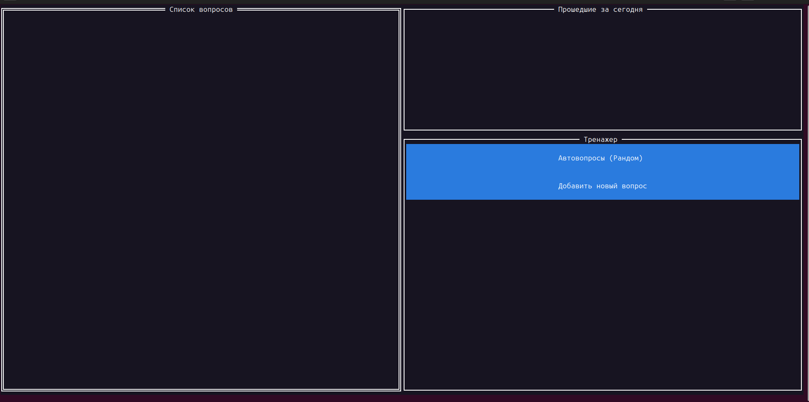
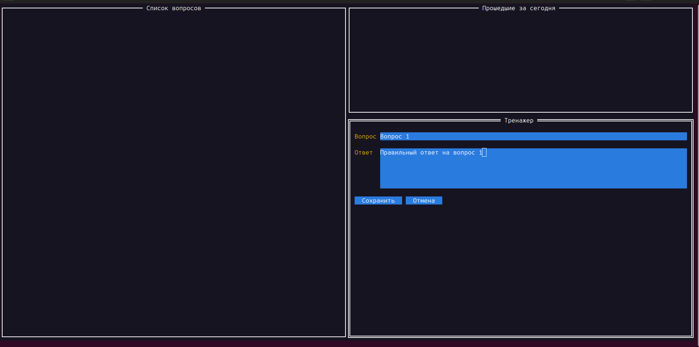
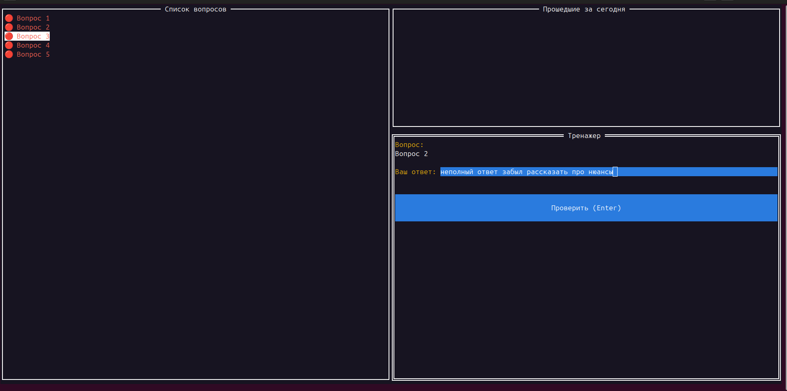
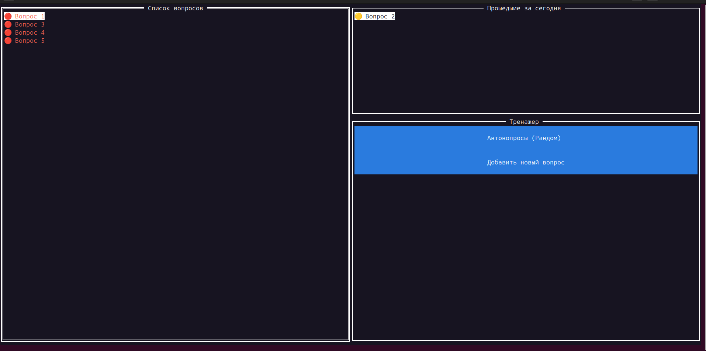

# Простой симулятор вопросов для подготовки к ревью, собеседованиям
## Как пользоваться
Клонируешь репозиторий, билдишь приложение. Если лень, можно сразу запустить бинарник **interview**  
**Важно!** Бинарник нужно запускать только в той директории, куда склонировали репо, т.к. файл БД будет находиться в корне  
В терминале нарисуется такое окно  

Кликаешь по кнопке "Добавить новый вопрос". Заполняешь вопрос и правильный (идеальный) ответ и сохраняешь  

В левом окне появится вопрос с красным статусом. Записываешь все вопросы.  
Теперь можно либо кликнуть по нужному вопросу в левом списке, либо кликнуть по кнопке "Автовопросы (Рандом)" и приложение
ранодомно будет выбирать вопросы. Если есть красные, то будут выбираться
вопросы только с красным статусом. Если красных нет, а есть желтые, то только из желтых и т.д.  
В блоке "Тренажер" появится окно с вопросом и окно, в которое нужно написать свой ответ. Потом кликаешь по "Проверить"
(клавиша Enter пока не работает)  

В открывшемся окне увидишь идеальный ответ на этот вопрос и тебе нужно будет
решить, как ты на него ответил.  
* Считаешь, что все правильно -> клик по кнопке "Правильно"
* Считаешь, что все правильно, но забыл о чем-то еще рассказать -> клик по кнопке "С правками"
* Считаешь, что очень плохо ответил -> клик по кнопке "Неправильно"  

В зависимости от нажатой кнопки, статус вопроса изменится на нужный цвет. Удалится из левого списка и перенесется в правый
с новым статусом.  

Пока фича работы с вопросами, отвеченными сегодня не работает. Пока только список. Если сегодня ответил на все вопросы и
хочешь снова их пройти, нужно выйти из приложения (ctrl+C) и снова запустить.  
Статусы вопросов обновляются только при старте приложения по такому сценарию  
* Если ответ на вопрос был дан неделю или более дней назад, то статус вопроса меняется на красный
* Если ответ на вопрос был дан от 4 до 6 дней назад, то он желтый

## Что не сделано и надо реализовать
* Добавить обработку выхода из приложения по кнопке "q"
* Добавить возможность передавать путь до файла с БД при запуске приложения
* Добавить возможность передавать количества дней для красного и желтого статусов при запуске приложения
* Добавить функционал работы с сегодняшними вопросами
* Добавить кнопку "пересчитать статусы", на случай, если из приложения не будут выходить
* Добавить внизу окно с логами, чтоб можно было видеть произошедшие ошибки
* Добавить обработку кнопки Enter в каждом окне
* Написать тесты и бенчмарки
* Проверить на race condition и data race
* Проанализировать pprof
